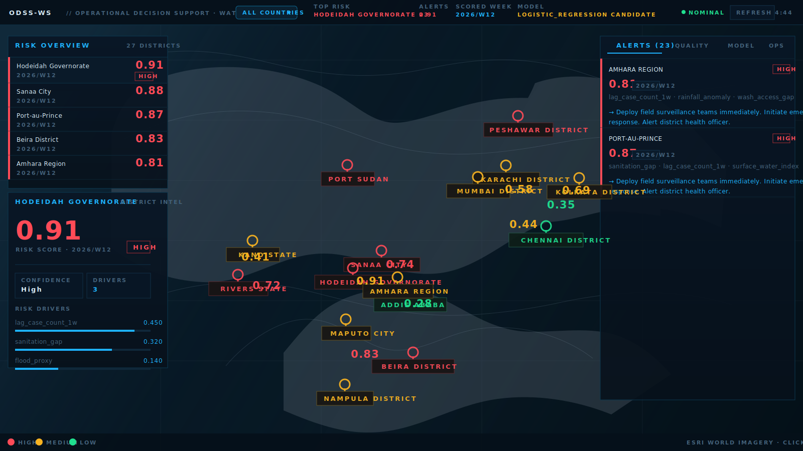

# OperationalDecisionSupportSystemForWaterSecurity
**Tagline:** Preempting Waterborne Disease Outbreaks with AI and Satellite Data.

## Core Problem
Over 2 billion people use a drinking water source contaminated with feces. Waterborne diseases like cholera, typhoid, and dysentery cause hundreds of thousands of deaths annually, often in low-resource communities. Outbreaks are traditionally detected reactively—after people get sick—leading to delayed and costly responses.

## Technical Solution
OperationalDecisionSupportSystemForWaterSecurity is an early-warning predictive modeling platform that shifts response from reactive to proactive.

### Data Fusion Engine
Aggregates and processes multi-modal data:
- **Remote Sensing:** NASA/USGS/ESA satellite data on sea surface temperature, chlorophyll-a levels (algae bloom proxy), precipitation, and flood inundation maps.
- **Climate and Weather:** NOAA forecasts, historical precipitation patterns, and drought indices.
- **Socio-economic and Infrastructure Data:** Population density, access to improved water sources (JMP data), and sanitation infrastructure from local governments and NGOs.
- **Crowdsourced and Sentinel Data:** Anonymous and aggregated mobility data to track population movement post-flooding, and local water quality reports from partner health clinics.

### Predictive AI Model
An ensemble model (e.g., Gradient Boosting plus LSTMs) trained on historical outbreak data. It identifies high-risk "hotspots" by correlating environmental precursors (e.g., a heatwave followed by heavy flooding) with a high probability of pathogen contamination in water supplies.

### Actionable Dashboard and Alerts
Provides a clear, GIS-based interface for public health officials at NGOs and government agencies. The system sends targeted SMS alerts to community health workers in predicted high-risk areas weeks before a potential outbreak.

## Dashboard Preview


## Impact and Equity Focus
- **Saves Lives:** Drastically reduces morbidity and mortality from preventable diseases.
- **Resource Optimization:** Allows NGOs and governments to pre-position water purification tablets, medical supplies, and health teams before a crisis hits, maximizing the impact of limited aid dollars.
- **Closes the Data Gap:** Brings advanced, space-age analytics to the most vulnerable communities who lack on-the-ground water testing resources.

## MVP: Predictive Risk Scoring
This proof-of-concept trains a model on locked Bangladesh pilot fixtures and predicts a **Waterborne Disease Risk Score (0–100)** for a given latitude, longitude, and date. When live Bangladesh covariates and weather files are available locally, the scoring step automatically upgrades to those inputs.

### How it Works
1. Join the bundled Bangladesh district fixtures for labels, weather, and static WASH covariates.
2. Train a tree-based regressor (**XGBoost if available**, else GradientBoosting).
3. Score the latest pilot districts and render a static risk map.

### Outputs
- `results/synthetic_training_data.csv` (legacy filename, now generated from locked pilot fixtures)
- `results/model_report.json`
- `results/risk_scored_points.csv`
- `results/risk_map.html`

## Hosting Guide
This repo has three different surfaces. They are not deployed the same way:

- GitHub Pages hosts the static root site from `index.html` and `data/`.
- Railway is the simplest place to host the FastAPI backend and Postgres-backed API.
- Vercel hosts the Next.js app in `services/web`.

GitHub Pages cannot run FastAPI, Postgres, or worker jobs. If you want live API data in the static site, the API must be hosted somewhere public such as Railway.

### GitHub Pages
Use GitHub Pages when you want the static landing page at the repo root.

- Branch: `main`
- Folder: `/(root)`
- Published URL: `https://hafsaghannaj.github.io/OperationalDecisionSupportSystemForWaterSecurity/`

The static site lives in:

- `index.html`
- `data/dashboard_snapshot.json`
- `data/risk_scored_points.json`

If no public API URL is configured, the page now falls back to `data/dashboard_snapshot.json`, so GitHub Pages still renders the seeded dashboard state.

To refresh the bundled snapshot from the local preview stack:

```bash
make preview-up
make preview-bootstrap
docker compose -f docker-compose.yml -f docker-compose.preview.yml exec -T api \
  python scripts/export_dashboard_snapshot.py --api-base http://127.0.0.1:8000 --out /app/data/dashboard_snapshot.json
```

Then commit and push the updated snapshot.

### Railway API
Use Railway to host the FastAPI backend. This repo already includes Railway config in `railway.toml`.

What Railway deploys:

- Dockerfile: `infra/docker/api.Dockerfile`
- Start command: `uvicorn services.api.app.main:app --host 0.0.0.0 --port ${PORT:-8000}`
- Release command: `bash scripts/railway_release.sh`

What the release command does:

- runs Alembic migrations
- seeds the multi-country demo data

Recommended Railway setup:

1. Create a new Railway project from this repo.
2. Add a Postgres service.
3. Deploy from the repo root.
4. Set these environment variables on the API service:

- `ODSSWS_ENVIRONMENT=production`
- `ODSSWS_DATABASE_URL=<Railway Postgres SQLAlchemy URL>`
- `ODSSWS_ALLOWED_ORIGINS=["https://hafsaghannaj.github.io"]`
- `ODSSWS_AUTH_TOKEN_SECRET=<long-random-secret>`
- `ODSSWS_AUTH_ISSUER=odssws`
- `ODSSWS_AUTH_AUDIENCE=odssws-operators`
- `ODSSWS_ALLOW_LEGACY_API_KEY=false`
- `ODSSWS_API_KEY=<optional-if-you-want-legacy-write-auth>`

If you also use Vercel, include the Vercel site origin in `ODSSWS_ALLOWED_ORIGINS` too.

Example:

```json
["https://hafsaghannaj.github.io","https://your-app.vercel.app"]
```

After Railway deploys, your API should answer:

```text
https://<your-railway-domain>/health
```

### Connect GitHub Pages To The API
Once the Railway API is live, point the static site at it in either of these ways:

1. Open the GitHub Pages site, go to the `OPS` tab, paste the public API URL, and click `SAVE API URL`.
2. Open the site with a query parameter:

```text
https://hafsaghannaj.github.io/OperationalDecisionSupportSystemForWaterSecurity/?api=https://<your-railway-domain>
```

For GitHub Pages CORS, the correct browser origin is:

```text
https://hafsaghannaj.github.io
```

Do not include the repository path in the CORS allowlist.

## Locked Pilot and Real Data Path
The current implementation is locked to a Bangladesh ADM2 weekly pilot defined in `config/pilot_definition.json`.

### Real label ingest
The worker now supports a real surveillance-label path in addition to the bundled local-development fixtures. Configure the label feed with:

- `ODSSWS_REAL_LABELS_MODE=dhis2_export`
- `ODSSWS_DHIS2_LABEL_EXPORT_URL` or `ODSSWS_DHIS2_LABEL_EXPORT_PATH`
- `ODSSWS_DHIS2_USERNAME`
- `ODSSWS_DHIS2_PASSWORD`
- `ODSSWS_REAL_LABEL_CASE_THRESHOLD`

When those values are absent, local bootstrap continues to use the bundled Bangladesh proxy labels for development only.

### Local step-by-step flow
```bash
make setup-full
cp .env.example .env
make migrate-local
make seed-local
make train-local
make demo-local
```

The dev bootstrap now trains a baseline model and scores with that model version directly, instead of falling back to the heuristic scorer during the same run.

### Preview stack flow
```bash
make preview-up
make preview-bootstrap
make preview-smoke
```

For a real-data preview run, set the `ODSSWS_REAL_LABELS_*` variables in `.env` and use:

```bash
make preview-real-bootstrap
```

`preview-db-prepare` is built into the preview bootstrap targets so existing local Postgres volumes from the earlier `aquaintel` naming do not block startup.

## Vercel Deploy
Use Vercel for the actual Next.js dashboard, not for the static root demo.

The Next.js app lives in `services/web`.

Recommended Vercel settings:

- Root Directory: `services/web`
- Framework Preset: `Next.js`
- Build Command: `npm run build`
- Environment Variable: `ODSSWS_API_BASE_URL=https://<your-api-domain>`

The web app uses a same-origin Next proxy at `/api/proxy/*`, so the browser does not need to call `localhost` directly.

If you deploy from the repo root anyway, `vercel.json` is configured to point Vercel at `services/web`, but the cleaner setup is still selecting `services/web` as the Root Directory in the Vercel dashboard.

### Recommended Production Layout
If you want the least confusing setup, use:

- GitHub Pages: static root landing page
- Railway: FastAPI API
- Vercel: Next.js app

That gives you:

- a simple public landing page from GitHub Pages
- a real backend with DB migrations and seeded data on Railway
- a separate full React/Next operator dashboard on Vercel

### DHIS2 validation and weather
`bootstrap_real_data_flow` now does four real-data steps in order:

1. validate the configured DHIS2 export
2. ingest normalized labels
3. fetch IMERG-equivalent rainfall for the exact label weeks
4. train and score using the newly trained model version

To validate the label feed before a full real bootstrap:

```bash
make real-labels-validate-local
```

### Operator auth
Write actions now support signed bearer tokens with operator roles. Configure:

- `ODSSWS_AUTH_TOKEN_SECRET`
- `ODSSWS_AUTH_ISSUER`
- `ODSSWS_AUTH_AUDIENCE`

Mint a token locally with:

```bash
PYTHONPATH=. .venv/bin/python scripts/mint_operator_token.py --operator-id ops-demo --roles operator,admin
```

The dashboard ops panel includes a bearer-token input so local operator actions can call the protected write endpoints without hardcoding a public token into the frontend.

## CAG Assistant (Cache-Augmented Generation)
This project includes a CAG layer that answers Q&A using a preloaded knowledge prompt and a KV cache (no retrieval). It is fully separate from the risk-scoring pipeline.

### What’s Included
- `src/outbreaks/cag/engine.py`: CAG engine with `DynamicCache`, cache cleanup per question, and greedy decoding.
- `knowledge/playbooks/general.md`: Base operational playbook knowledge.
- `knowledge/regions/`: Optional region-specific context files.
- `src/outbreaks/cag/api.py`: FastAPI route `POST /cag/ask`.
- `src/outbreaks/cag/ask.py`: CLI entrypoint.
- `services/api/app/main.py`: integrated CAG, pilot, demo, and operator-audit API surface.

## Operator Workflow
The dashboard and API now support the core operator loop:

- review district alerts
- acknowledge or resolve alert events
- promote model runs
- log field actions and operator notes
- inspect the recent audit trail from `GET /audit/logs`

### Quick Start
```bash
PYTHONPATH=src python3 -m outbreaks.cag.ask --question "What actions are recommended at elevated risk?" --region "example_region"
```

### API
```bash
PYTHONPATH=src uvicorn outbreaks.cag.api:app --host 0.0.0.0 --port 8000
```

Request:
```json
{ "question": "What should we do at critical risk?", "region_key": "example_region" }
```

Response:
```json
{ "answer": "...", "used_region": "example_region", "cache_type": "region" }
```

## Docker
Build and run the CAG API with Docker:

```bash
docker build -t outbreaks .
docker run --rm -p 8000:8000 outbreaks
```

Or with docker-compose:
```bash
docker compose up --build
```
